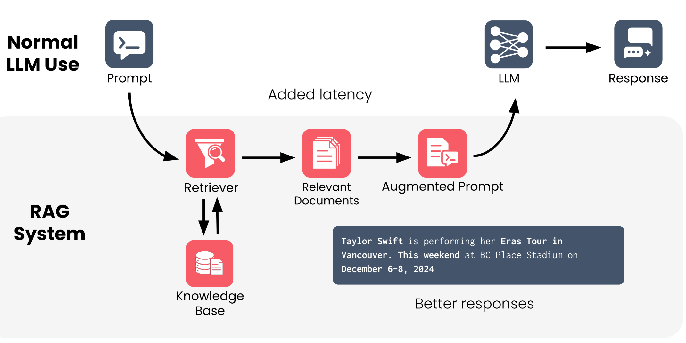

**Course Link:** [DeepLearning.ai](https://www.deeplearning.ai/courses/retrieval-augmented-generation)

# Module # 1: Introduction to RAG
# Merge it at 6
- RAG is used for further improvements of LLMs by attaching new information to them.
- LLMs cannot access hard to access information
- LLMs Cannot access real time data
- **Retriever:** It takes prompt -> Translates them into queries -> searches the knowledge base for relevant result (usually done using vector search) -> Gathers top results and them to the LLM
- **Use cases:** Legal and medical use cases, Uses specialized documents, Case files, journals, private data, Enables accurate, secure use, Supports precision and privacy needs.
- We can run search engines as Retrievers, the internet aas the knowledge base, and use ai to summarize the information.
